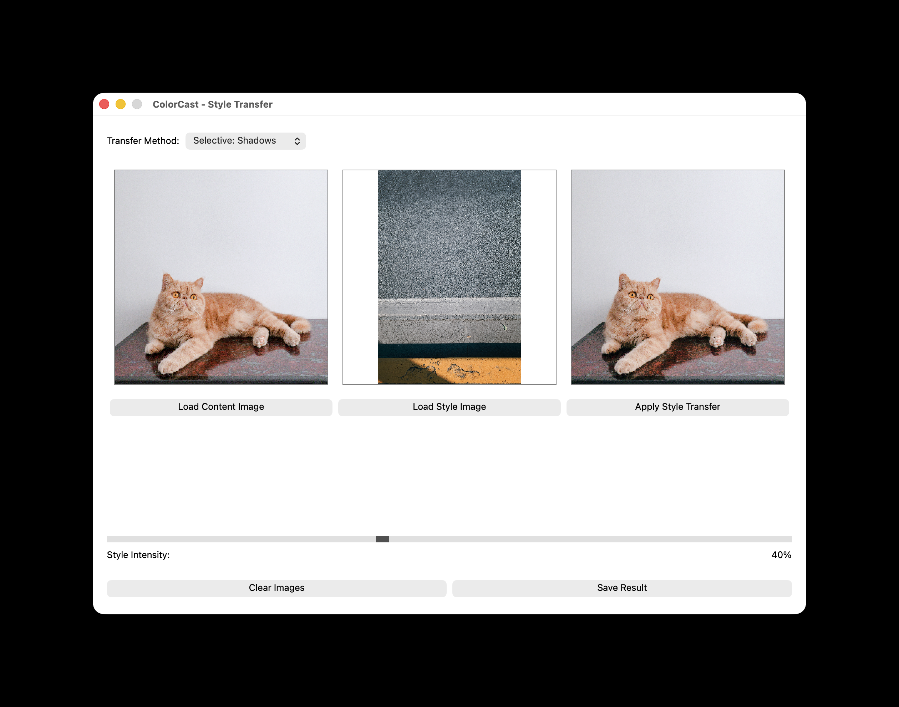

# ColorCast

A sophisticated PyQt5 GUI application for advanced color and style transfer between images. ColorCast offers multiple algorithms including histogram matching, mean/std transfer, LUT-based curves, and selective regional color transfer.

## Interface



_ColorCast's intuitive interface showing content image, style image, and result panels_

## Features

### Core Features

- **Easy-to-use GUI** with intuitive button-based interface
- **8 Transfer Methods** - Choose from multiple algorithms for different effects
- **Intensity Control** - Smooth slider (0-100%) to blend between original and styled images
- **Automatic image resizing** - works with images of different dimensions
- **Multiple format support** - PNG, JPG, JPEG, BMP, TIF, TIFF
- **Smart image preprocessing** - automatically handles grayscale and RGBA images
- **Real-time preview** with optimized performance
- **Robust error handling** for corrupted or unsupported files
- **High-quality output** with preserve aspect ratio scaling

### Transfer Methods

1. **Histogram Matching** - Classic histogram equalization, preserves local contrast
2. **Mean/Std Transfer** - Statistical color matching using mean and standard deviation
3. **LUT + Linear Curve** - Histogram matching with linear tone mapping
4. **LUT + S-Curve** - Adds smooth contrast enhancement to histogram matching
5. **LUT + Contrast** - Increases overall contrast with power curve
6. **Selective: Shadows** - Transfers colors only in dark regions (luminance < 0.3)
7. **Selective: Midtones** - Transfers colors only in mid-tones (0.3 to 0.7)
8. **Selective: Highlights** - Transfers colors only in bright regions (luminance > 0.7)

## How It Works

ColorCast provides multiple sophisticated algorithms for color transfer:

**Basic Workflow:**

1. **Select Transfer Method**: Choose your preferred algorithm from the dropdown
2. **Load Content Image**: The image you want to transform
3. **Load Style Image**: The image whose color palette/mood you want to copy
4. **Apply Transfer**: The algorithm processes the images
5. **Adjust Intensity**: Fine-tune the effect strength with the slider
6. **Save Result**: Export your color-graded image

**Algorithm Details:**

- **Histogram Matching**: Matches complete color distributions between images
- **Mean/Std Transfer**: Adjusts mean and standard deviation per RGB channel
- **LUT Curves**: Apply tone curves (linear, S-curve, contrast) after histogram matching
- **Selective Transfer**: Uses luminance-based masking to target specific tonal ranges

## Installation

1. Clone this repository:

```bash
git clone https://github.com/MichailSemoglou/ColorCast.git
cd ColorCast
```

2. Create a virtual environment:

```bash
python -m venv .venv
source .venv/bin/activate  # On Windows: .venv\Scripts\activate
```

3. Install dependencies:

```bash
pip install -r requirements.txt
```

## Usage

Run the application:

```bash
python colorcast.py
```

### Step-by-step:

1. **Select Transfer Method**: Choose from 8 different algorithms at the top
2. **Load Content Image**: Click to select your base image
3. **Load Style Image**: Click to select the image whose style you want to copy
4. **Apply Style Transfer**: Click to process the images
5. **Adjust Intensity**: Use the slider to control the effect strength (0-100%)
6. **Save Result**: Export the final image in your preferred format
7. **Clear Images**: Reset and start over with new images

### Tips for Best Results:

- **Histogram Matching**: Best for artistic effects and dramatic color shifts
- **Mean/Std Transfer**: Better for subtle, natural-looking color grading
- **LUT Curves**: Experiment with different curves for varied contrast effects
- **Selective Transfer**: Target specific tonal ranges for precise control
  - Shadows: Affect only dark areas
  - Midtones: Affect only mid-tones (most natural skin tones)
  - Highlights: Affect only bright areas

## Requirements

- Python 3.7+
- NumPy
- scikit-image
- scipy
- PyQt5

See `requirements.txt` for specific versions.

## Examples

The application works great for:

- **Film color grading** (matching scenes shot at different times)
- **Photography** (applying vintage or cinematic looks)
- **Art creation** (transferring painting styles to photos)
- **Social media content** (consistent color themes)

## Technical Details

### Algorithms Implemented

1. **Histogram Matching**:

   - Per-channel histogram equalization
   - Preserves complete color distribution
   - Best for dramatic color transformations

2. **Mean/Standard Deviation Transfer**:

   - Formula: `result = ((source - μ_source) × (σ_ref / σ_source)) + μ_ref`
   - Matches statistical properties per channel
   - Better color balance for photographic work

3. **LUT with Curves**:

   - Linear: Standard histogram matching
   - S-Curve: `0.5 + 0.5 * sin(π(x - 0.5))` - smooth midtone enhancement
   - Contrast: `x^0.8` - power curve for increased punch

4. **Selective Color Transfer**:
   - Luminance calculation: `0.299R + 0.587G + 0.114B`
   - Region-based masking (shadows < 0.3, midtones 0.3-0.7, highlights > 0.7)
   - Precise tonal range targeting

### Performance Features

- **Cached processing**: Styled image cached for instant intensity adjustments
- **Debounced slider**: 50ms delay prevents UI blocking
- **Automatic format conversion**: Grayscale → RGB, RGBA → RGB
- **Anti-aliasing**: High-quality image resizing
- **Memory efficient**: Processes images in-place where possible

## Contributing

Feel free to submit issues, fork the repository, and create pull requests for any improvements.

## License

This project is open source and available under the [MIT License](LICENSE).
